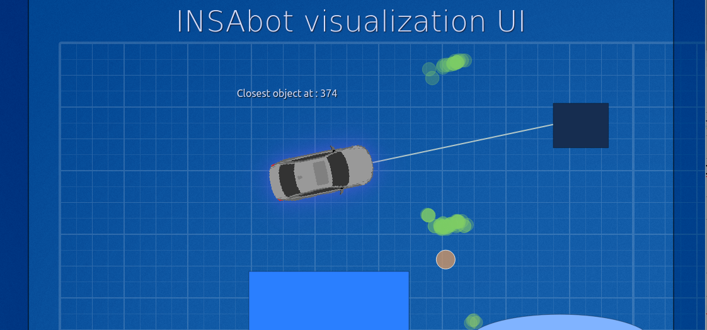

# Autonomee

A Python front-end for robot localization (and other uses) using SVG for maps' representation and Qt for the UI.

You can also check the robot's arduino sketch, __arduino.ino__. 

## Features

* A basic SVG parser
* A pathfinder (A\*)
* Nearest obstacle detection (to simulate the sensor's measurements)
* Basic probability model : particle filter. (hopefully we'll also implement one based on Kalman's filter)
* Visualization of the robot's movements and the particles used to localize it.
* A client/server to push commands to the car and control it (through serial ports)

## Dependencies

* Python 2.7
* Qt and PySide (Qt's python binding)
* Numpy
* PySerial
* Scipy

## Important

This is a work in progress and the code base can change very radically. Don't except (for now) something working out of the box  !

## Updates :

### 2 May 2013

The project's name has changed from 'Carosif' to 'Autonomee'.

### 28 April 2013

We've added many major features, including a dashboard showing the sensors' data, a dialog to configure the car's properties and the visualization of the particle filter.

Here's a video showing the particle filter in action :

http://www.youtube.com/watch?v=Mcl2Vz46rro

### 25 March 2013

This now also includes a server/client made to be used in a Raspberry Pi connected to the Arduino controlling the car. Check how that work out in a 'joystick controlled' mode :

https://www.youtube.com/watch?v=rbX47X8HtGU
