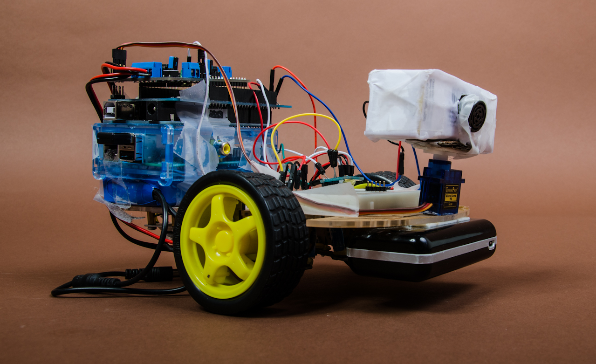
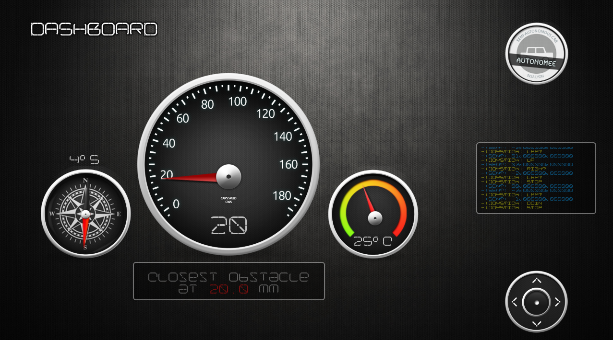
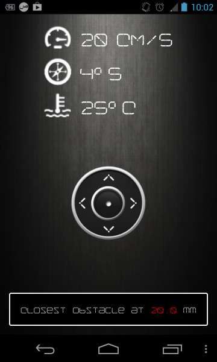

# autonomee




A client/server for robot localization (using a 'particle filter') and distant control.

For the (real) car, an arduino (for motor control and sensor readings) and  a raspberry pi (for communication) are used.
You can the robot's arduino sketch, __autonomee.ino__, __car.h__ and __compass.h__. 

## Features


* A basic SVG parser
* A pathfinder (A\*)
* Nearest obstacle detection (to simulate the sensor's measurements)
* Basic probability model : particle filter. (hopefully we'll also implement one based on Kalman's filter)
* Visualization of the robot's movements and the particles used to localize it.
* A client/server to push commands to the car and control it (through serial ports)

## Dependencies

* Python 2.7
* Qt and PySide (Qt's python binding)
* Numpy
* PySerial
* Scipy

## Communication protocol

The packets sent to the server (TCP) respect this format:

```OPCODE(2 chars) + "#" + OPERANDE 1 (6 chars) + "#" + OPERANDE 2 (6 chars)```

### Supported operations

* Running forward: ```OPCODE=01``` ; Example : ```01#000000#000000```

* Running backward: ```OPCODE=-1```; Example : ```-1#000000#000000```

* Turning right : ```OPCODE=02``` ; Example : ```02#000000#000000```

* Turning left : ```OPCODE=-2``` ; Example : ```-2#000000#000000```

* Setting speed : ```OPCODE=05```, first operand is a factor ranging from 0 to 250. ; Example : ```05#000180#000000```

## Mobile app

A (responsive) mobile (Android) client compatible with the communication protocol used has been developped by Alexis Fasquel.





## Updates :

### 22 May 2013

We presented this project (initally a class project) to our fellow students (@INSA Lyon) today. You can check the presentation (in French) here: https://slid.es/halflings/autonomee

### 2 May 2013

The project's name has changed from 'Carosif' to 'Autonomee'.

### 28 April 2013

We've added many major features, including a dashboard showing the sensors' data, a dialog to configure the car's properties and the visualization of the particle filter.

Here's a video showing the particle filter in action :

http://www.youtube.com/watch?v=Mcl2Vz46rro

### 25 March 2013

This now also includes a server/client made to be used in a Raspberry Pi connected to the Arduino controlling the car. Check how that work out in a 'joystick controlled' mode :

https://www.youtube.com/watch?v=rbX47X8HtGU
